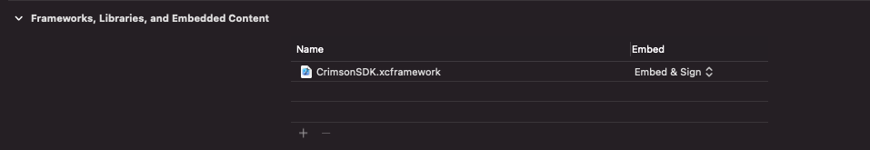

# iOS

## Download

- [下载SDK](https://focus-resource.oss-cn-beijing.aliyuncs.com/universal/crimson-sdk-prebuild/1.1.0/ios/CrimsonSDK.xcframework.zip)
- [下载Example-CocoaPods](https://focus-resource.oss-cn-beijing.aliyuncs.com/universal/crimson-sdk-prebuild/1.1.0/ios/CrimsonSDKExample.zip)
- [演示视频](https://focus-resource.oss-cn-beijing.aliyuncs.com/universal/crimson-sdk-prebuild/1.0.0/ios/example.mp4)

## Requirement

- iOS 10.0+
- arm64
- BitCode Disabled

## Integration

### CocoaPods (iOS 10.0+)

You can use CocoaPods to install **CrimsonSDK** by adding it to your Podfile:

```ruby
platform :ios, '10.0'

use_frameworks!

pod 'CrimsonSDK', :podspec => 'https://focus-resource.oss-cn-beijing.aliyuncs.com/universal/crimson-sdk-prebuild/1.1.0/ios/CrimsonSDK.podspec'
```

### 手动集成

- Project->Target->General->Linked Frameworks, Libraries and Embedded Content
  

#### Dependencies

- Accelerate.framework
- CoreBluetooth.framework
- libc++.tbd

### Info.plist

```swift
<key>NSBluetoothAlwaysUsageDescription</key>
<string>APP需要通过蓝牙功能连接头环设备</string>

<--蓝牙后台访问权限-->
<key>UIBackgroundModes</key>
<array>
<string>bluetooth-central</string>
</array>
```

## Usage

### FAQ



### Scan 扫描

#### 首次配对新设备时，需要先将头环设置为 _配对_ 模式-->蓝灯快闪

```swift
// 开启扫描
BLEDeviceManager.shared.startScan()
BLEDeviceManager.scannerDelegate = self

extension ScanVC: CrimsonScannerDelegate {
    func centralManagerDidUpdateState(_ state: CBManagerState) {
        if state == .poweredOn {
            BLEDeviceManager.shared.startScan()
        }
    }

    func onFoundDevices(_ devices: Array<CrimsonDevice>) {
        self.devices = devices
        //TODO: show scan result
    }
}
```

### Connect 连接

```swift
// NOTE: 开启扫描与停止扫描要成对，连接之前需停止扫描
BLEDeviceManager.shared.stopScan()
device.delegate = self
device.connect()

extension ScanVC: CrimsonDelegate {
    func onConnectivityChanged(_ connectivity: Connectivity) {
        if connectivity == .connected {
            let device = devices[selectedIndex]
            self.pair(device: device)
            return
        }
    }
}

// CrimsonDelegate
@objc public protocol CrimsonDelegate {
    @objc optional func onError(_ error: CrimsonError)
    @objc optional func onDeviceInfoReady(_ deviceInfo: DeviceInfo)//蓝牙设备信息
    @objc optional func onSystemInfo(_ systemInfo: SystemInfo) //自动休眠信息，震动强度
    // 电量, batteryLevel 区间在0~100, -1表示未知
    @objc optional func onBatteryLevelChange(_ batteryLevel: Int)
    @objc optional func onConnectivityChange(_ connectivity: Connectivity)//连接状态

    //******************** NOTE: invoked after startEEG *******************
    @objc optional func onContactStateChange(_ contactState: ContactState)//佩戴状态
    // NOTE: invoked after startIMU
    @objc optional func onOrientationChange(_ orientation: Orientation)//佩戴方向
    @objc optional func onIMUData(_ imu: IMU) // 陀螺仪数据
    @objc optional func onEEGData(_ eeg: EEG) // 脑电EEG数据
    @objc optional func onBrainWave(_ wave: BrainWave) //脑电频域波段数据
    @objc optional func onAttention(_ attention: Float)  //注意力指数
    @objc optional func onMeditation(_ meditation: Float)//冥想指数
    @objc optional func onBlink() // 眨眼事件
}
```

### Pair 配对

```swift
func pair(device: CrimsonDevice) {
    startUIBlockingIndicator(message: "Pairing")
    device.delegate = self
    device.pair { resp in
        stopUIBlockingIndicator()
        if resp.success() {
            cmsn_print("pair success")
        } else {
            cmsn_print("pair failed")
            BLEDeviceManager.shared.startScan() //restart scan device

            if let sysResp = resp as? SysConfigResponse, sysResp.error?.code == .validatePairInfo {
                // TODO: 检验配对信息失败
            }
        }
    }
}
```

### OTA

```swift
public class CrimsonOTA {
    public static var latestVersion = ""
    public static var url = ""
    public static var desc = ""
    public static var descEN = ""
}

boolean ret = device.isNewFirmwareAvailable();
print("isNewFirmwareAvailable=\(ret)");
print("latestVersion=\(CrimsonOTA.latestVersion)");
print("desc=\(CrimsonOTA.desc)");

device.startDfu(self)
extension DFUViewControler: CrimsonOtaDelegate {
    func onSuccess() {
        logI("ota Success")
    }
    func onFailure(_ error: CrimsonError?) {
        if error != nil { logI("ota Failure, error=\(error!.message)") }
    }
    func onProgress(_ progress: Int) {
        logI("ota progress=\(progress)")
    }
}
```

### Model

```swift
// 头环连接状态
@objc public enum Connectivity: Int, CaseIterable {
    case connecting = 0
    case connected = 1
    case disconnecting = 2
    case disconnected = 3
}
// 佩戴状态，电极与皮肤接触良好
@objc public enum ContactState: Int, CaseIterable {
    case unknown = 0
    case contact = 1   //佩戴好
    case noContact = 2 //未戴好
}
// 佩戴方向，检测是否佩戴反
@objc public enum Orientation: Int, CaseIterable {
    case unknown
    case upward   //头环戴正
    case downward //头环戴反
}
// EEG, 默认为每秒回调5次
@objc public class EEG: NSObject {
    @objc public let sequenceNumber : Int
    @objc public let sampleRate: Float
    @objc public let eegData: [Float]
    @objc public let signalType: AFEDataSignalType
}
// 脑电频域波段能量
@objc public class BrainWave: NSObject {
    @objc public let delta : Double
    @objc public let theta : Double
    @objc public let alpha : Double
    @objc public let lowBeta : Double
    @objc public let highBeta : Double
    @objc public let gamma : Double
}

@objc public enum CrimsonErrorCode: Int32{
    case none = 0
    case unknown = -1
    case messageBuildingFailed = -2
    case paramsError = -3

    case deviceNotConnected = -160
    case deviceUuidUnavailable = -196

    case otaDownload = -200
    case otaDfu = -20
}


@objc public class CrimsonError: NSObject {
    @objc public let code: CrimsonErrorCode
    @objc public let message: String

    init(code:CrimsonErrorCode) {
        self.code = code;
        switch code {
            case .none:
                message = "Success"
            case .unknown:
                message = "Unknown error" //未知错误
            case .messageBuildingFailed:
                message = "Message building failed" //发送消息构建失败
            case .deviceNotConnected:
                message = "Device not connected" //设备不可用
            case .deviceUuidUnavailable:
                message = "Failed to obtain iOS device UUID" //获取idfv失败
            default:
                message = "Unknown error case" //未知code
        }
    }
}

//SysConfig命令，固件返回error
@objc public enum SysConfigErrorCode: Int32 {
    case none = 0
    case unknown = 1 //未知错误
    case otaFailedLowPower = 2 //低电量进入OTA失败
    case pairError = 3 //配对失败
    case validatePairInfo = 4 //检验配对信息失败
    case internalStorageError = 5  //内部存储错误
}

@objc public class SysConfigError: NSObject {
    @objc public let code: SysConfigErrorCode
    @objc public let message: String

    init(code:SysConfigErrorCode){
        self.code = code
        self.message = String(cString: sys_config_err_code_to_msg(code.rawValue))
        super.init()
    }
}
```

### StartEEG 开启传输脑电数据

```swift
device.delegate = self
device.startEEGStream()
```

### StartIMU 开启传输陀螺仪数据

```swift
// IMU SampleRate 采样频率
@objc public enum IMUDataSampleRate: Int, CaseIterable {
    case unused
    case sr12_5 //默认使用
}

device.delegate = self
device.startEEGStream()
device.startIMU() { (resp) in
    if resp.success() {
        self.toast("start imu success")
    } else {
        self.toast("\(resp.message())")
    }
}
```

### More

```swift
// 设置日志级别，默认为INFO
CrimsonSDK.setLogLevel(LOG_LEVEL_ERROR)
CrimsonSDK.setLogLevel(LOG_LEVEL_INFO)

public func connect()
public func disconnect()
public func pair(onResponse: @escaping CrimsonRespCallback)
public func getSystemInfo(onResponse: @escaping CrimsonRespCallback)

public func startEEGStream()
public func stopEEGStream()
public func startIMU(sampleRate: IMUDataSampleRate, onResponse: @escaping CrimsonRespCallback)
public func stopIMU(onResponse: @escaping CrimsonRespCallback)

// @param name length should be 4 ~ 18
public func setDeviceName(_ name: String, onResponse: @escaping CrimsonRespCallback)

// public typealias SKColor = UIColor
public func setLEDColor(_ color: SKColor, onResponse: @escaping CrimsonRespCallback)

// @param timeSec => seconds to put device into sleep mode, 0 for no sleep
public func setSleepIdleTime(_ timeSec: Int, onResponse: @escaping CrimsonRespCallback)

// @param intensity => vibration intensity, 0 ~ 100
public func setVibrationIntensity(_ intensity: Int, onResponse: @escaping CrimsonRespCallback)
```
